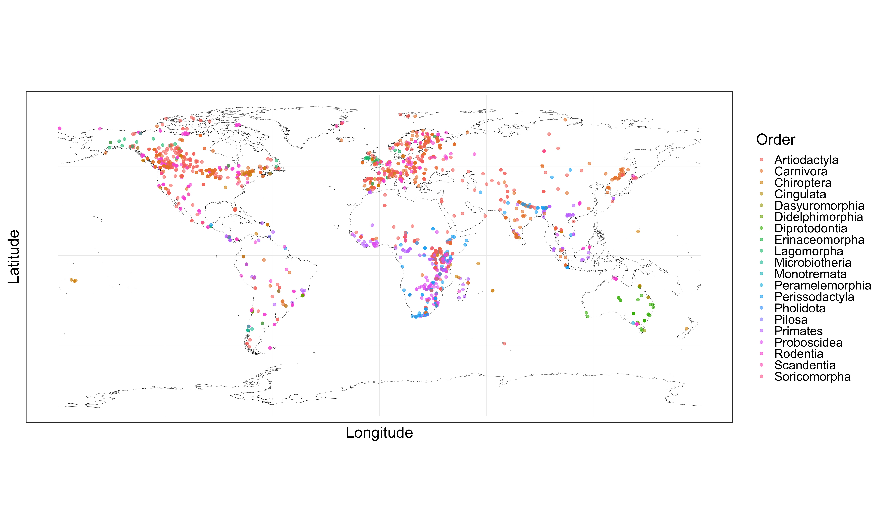
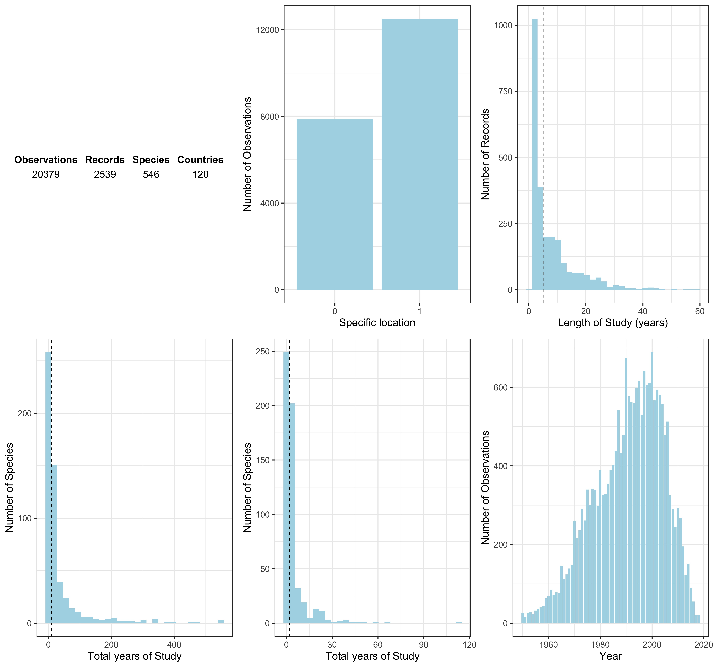
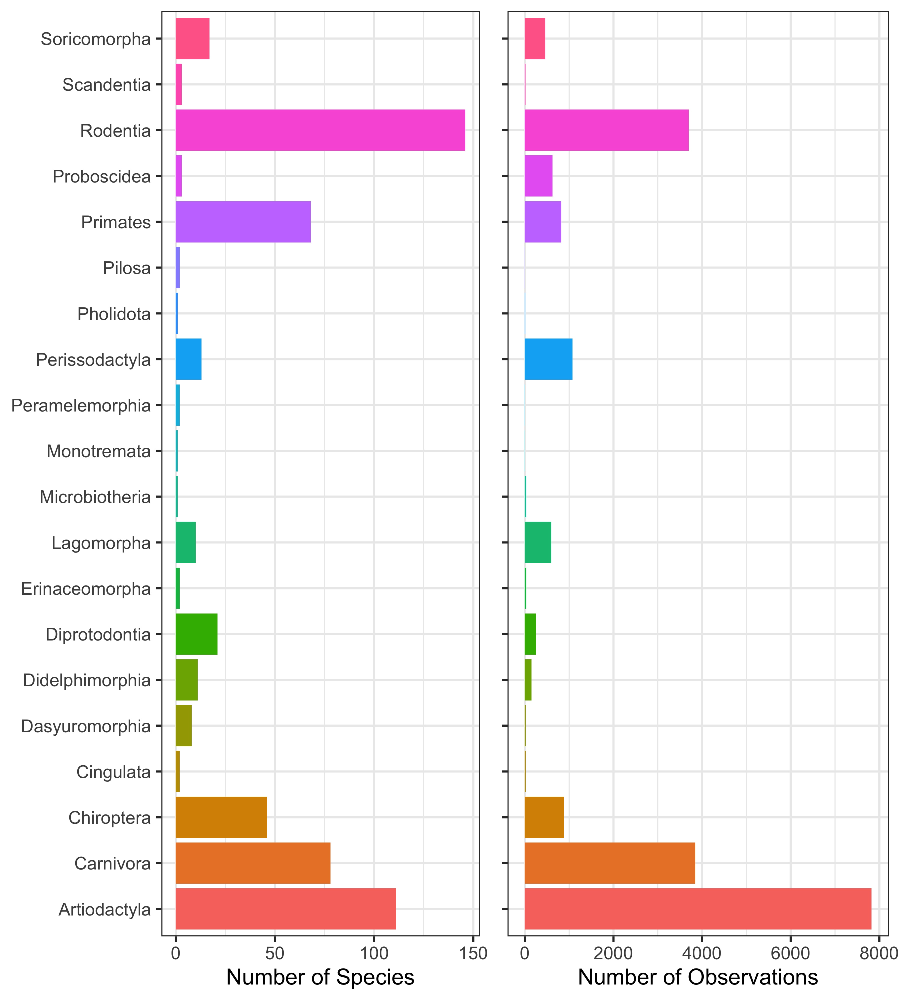
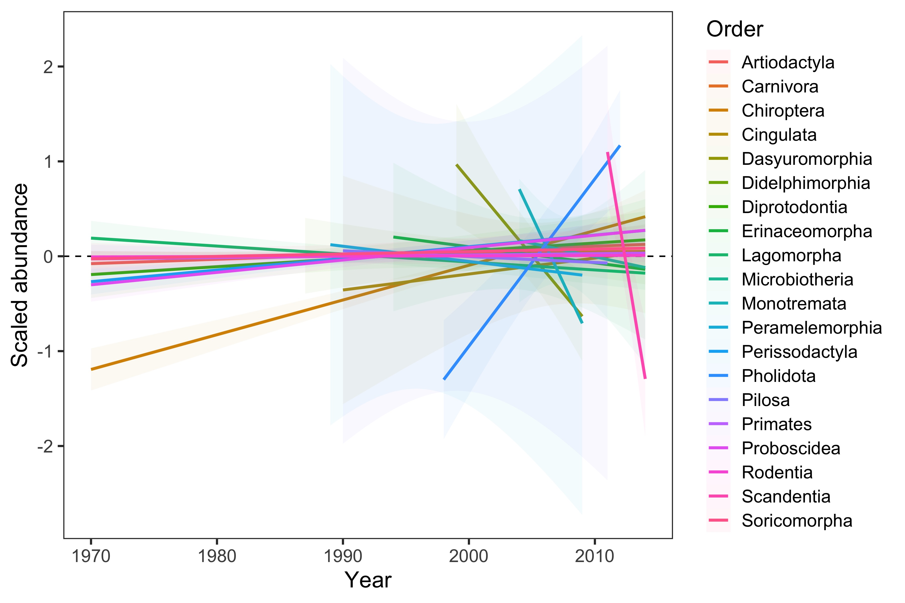

# Pilot study: Global weather and changes in vertebrate abundance

---

Pilot study on terrestrial mammals to investigate how weather influences annual changes in abundance.

Here we are making use of:

1. The Living Planet Index (LPI) database of annual vertebrate abundances, which can be found at https://livingplanetindex.org/home/index.
2. The CHELSA Climatologies at high resolution for the earth’s land surface areas 1979-2013, which is from [Karger et al. (2017)](https://www.nature.com/articles/sdata2017122).

---

The analysis is split into the following sections:

1. Extracting data from CHELSA for the localities of the living planet index studies.
2. Exploring both the CHELSA data and the Living Planet Index data.
3. Exploring a range of local weather variables from the CHELSA data.
4. Detrending annual abundance data to focus on annual changes excluding underlying trends.
5. ...

---

## 1. Extracting data from CHELSA for the localities of the living planet index studies

The data from CHELSA is in the form of raster files (`.tif`), which can be downloaded from [here](http://chelsa-climate.org/downloads/). The rasters are at a spatial resolution of 30 arc sec, which is approximately 1 km$^2$, and records are between 1979-2013. There are several monthly/annual timeseries measures of temperature and precipitation. Here we focus on monthly mean temperature and total precipitation from CHELSA `version 1.2.1`.

Access of the CHELSA raster files for mean monthly temperature and total precipitation took the general form 

```
#!/usr/bin/env bash 
wget https://www.wsl.ch/lud/chelsa/data/timeseries/tmean/CHELSA_tmean_1979_01_V1.2.1.tif
wget https://www.wsl.ch/lud/chelsa/data/timeseries/prec/CHELSA_prec_1979_01_V1.2.1.tif
```

Full scripts can be accessed from https://github.com/jonesor/compadre-climate.

Below is an example of the mean temperature for 30 arc sec grid cells from August 1993.


---

The first task is to align and extract data from the CHELSA rasters for the study sites that are used in the Living Planet Index (LPI) database. Access to the LPI database can be obtained at https://livingplanetindex.org/home/index. Each study in the LPI comes with a coordinate location of where the study took place. This is not always in reference to a specific population location, but instead gives the user a general idea about the locality of the abundance record. Therefore, we also need to consider broader spatial polygons that are informed by the inital LPI study coordinates.

The data used in the current study consists of **2539** Living Planet Index records from the terrestrial mammals, for which the locations are presented below, coloured by the taxonomic order.



And below we present some exploratory plots of the mammal LPI data used in the current pilot study.

### Mammal living planet index summary





