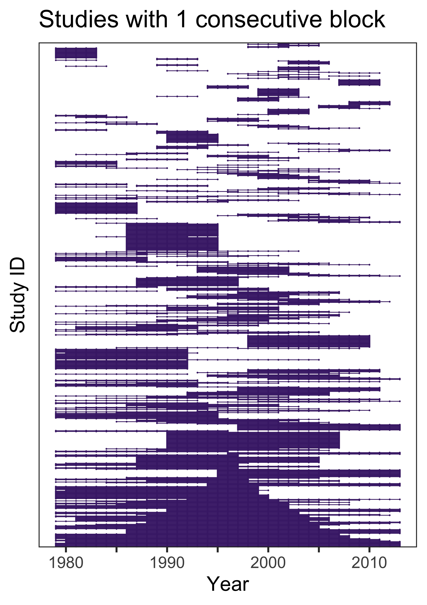

# Detrending annual abundance change data

#### 2020-05-06 
#### John Jackson

---

This mardown is intended as an accompaniment to the scripts contained within the directory `annual_abundance_changes`, to walk through the process of detrending annual abundance data from the Living Planet Database for the terrestrial mammals. Please refer to the scripts mentioned in each section of the markdown for full details on each section.

There are * main sections and scripts:

## 1. Exploring and accounting for gaps in the abundance timeseries
<details>
  <summary>Click here to expand</summary>

### `timeseries_gap_exploration.R`

In relation to our study question of exploring how weather influencs annual population changes in vertebrates, one potential problem with the vertebrate abundance data from the Living Planet Database is that there are gaps in the timeseries. So, if we are interested in how weather influences annual changes in abundance, the number of these gaps and the way we deal with them is important. This first section is intended to explore the pervasiveness of these gaps across our studies, and deal with them in an appropriate way for further analysis.

We first have to restrict the data to only include potential studies that have sufficient data with which to explore annual changes abundance in relation to CHELSA weather data. We only include observations that overlap with the CHELSA data i.e. between 1979-2013, and those that have 5 or more years of abundance data:

```
mam <- mam %>% 
  filter(year >= 1979 & year <= 2013) %>% # important to do this first
  group_by(ID) %>% 
  mutate(n = n()) %>% 
  ungroup() %>% 
  filter(n >= 5) %>% 
  dplyr::select(-n)
```

Now we present the example of a population timeseries with 5 observations of population density from the Fossa (Cryptoprocta ferox), which is endemic to Madagascar. There are 5 observations between 2008 and 2013.


However, we have a gap in the data in 2009. We could interpolate this value when we detrend the timeseries, but since we are investigating changes in annual abundance, we are actually interested in annual deviation in abundance. Therefore, a better strategy is to map these gaps across all of our studies and investigate if there is a way of splitting the timeseries up when we investigate the effect of weather.

We make use of the differences in years to split each study's timeseries in to blocks. We compute some summary statistics for each study `mam_gaps`, including the number of these blocks, the proportion of the data that is a timeseries with 1-year transitions, and the longest continuous block in the study. In `mam_blocks`, we record all the blocks for each study and keep the raw data:

```
mam_gaps <- mam %>% 
  group_by(ID) %>% 
  group_modify(~{
    cyears = .$year
    diff_cyears = diff(cyears)
    cumsum_blocks = cumsum(c(1, diff_cyears != 1))
    
    summarise(., Binomial = Binomial[1],
              study_length = length(cyears),
              no_consecutive_blocks = n_distinct(cumsum_blocks),
              prop_1year_transitions = sum(diff_cyears == 1)/ length(diff_cyears),
              longest_block = max(table(cumsum_blocks)))
  }) %>% 
  ungroup()

mam_blocks <- mam %>% 
  group_by(ID) %>%
  mutate(block = cumsum(c(1, diff(year) != 1)),
         max_block = max(block)) %>% 
  ungroup() %>% 
  dplyr::select(ID, Binomial, Order, scaled_abundance, 
                year, block, max_block) %>% 
  left_join(x = ., y = dplyr::select(mam_gaps, -c(Binomial, no_consecutive_blocks)),
            by = "ID") %>% 
  arrange(desc(longest_block)) %>% 
  mutate(ID = factor(ID, levels = unique(.$ID)))
```
### Time series gap summaries

Encouragingly, the majority of the data is occuring in continuous blocks with 1-year transitions. Here we have the distribution of the proportion of each study that is occuring in 1-year transitions. We can see that the majority have all their data as 1-year transitions. Furthermore >76% (870) of the studies have more than 2 thirds of their data in 1-year transitions.


However, this doesn't quite give us the full picture because we also need to know how many blocks each time series occurs in. Here we plot the number of blocks that each study occurs in against the number of years in its longest block. The colour denotes the proportion of the timeseries occuring in 1-year transitions.


So it does appear that there are some studies that are primarily in timeseries with 1-year transitions (lighter colours), but do occur over quite a few blocks of observations. We can also plot these blocks of observations as timelines, where we see the years of data for each study ID. I have split these up based on the number of blocks that the timeseries occurs in for ease. Here first you have the studies that are just occuring in 1 consecutive block. Points and lines indicate where there is data for each study ID (row).



These are the 'gold standard' studies that occur solely in one consecutive chain of annual observations (with more than 5 years of data). However, the picture becomes a little bit more complex when we look at studies that occur in a greater number of blocks. Here you can see the studies taht occur in 5 blocks.


We can see here that there are scenarios where there are longer consecutive blocks of observations, with smaller satellite blocks with fewer observations.

### Data selection

</details>


---


