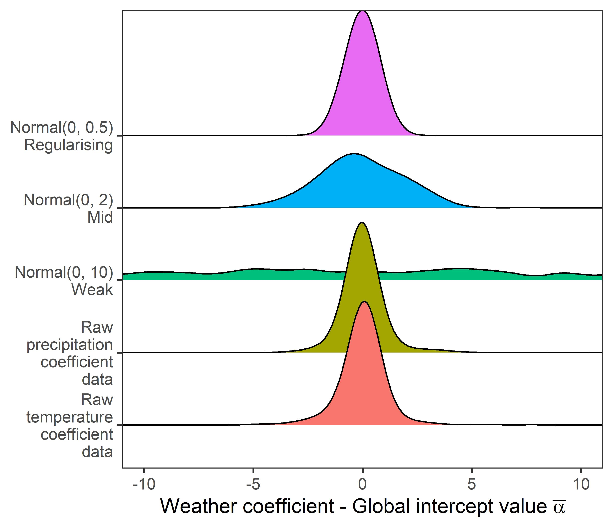
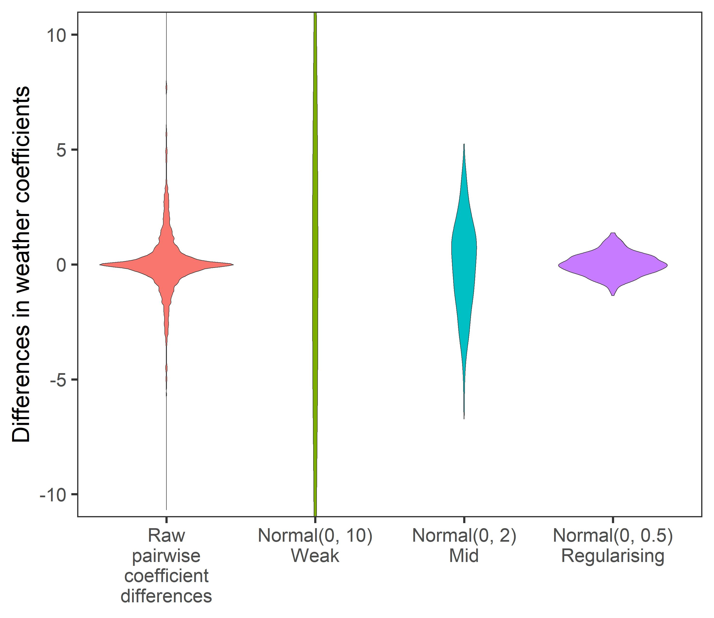
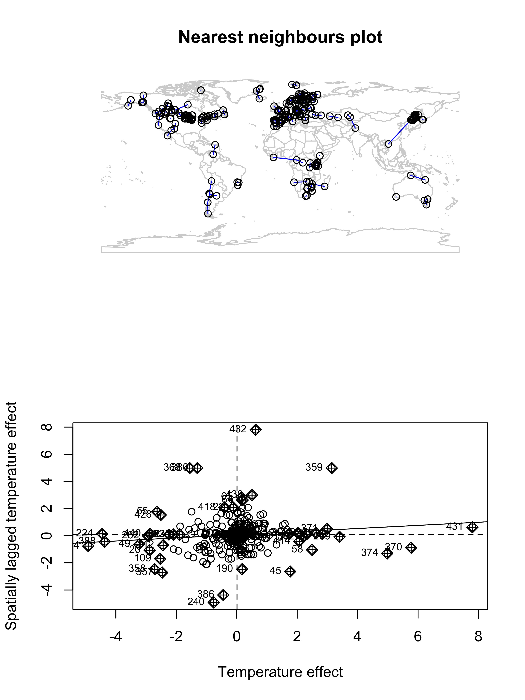
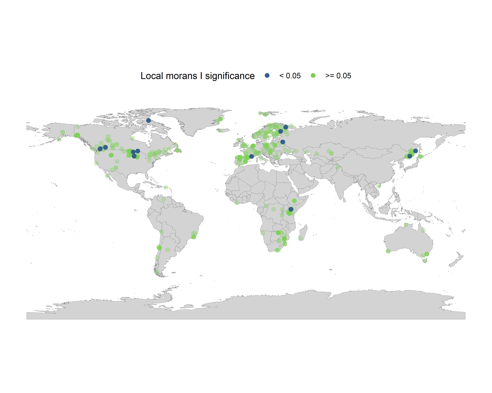

# Meta regression exploring patterns of weather effects on abundance change in the terrestrial mammals

#### 2021-03-17
#### John Jackson

---

This markdown is intended as an accompaniment to the scripts contained within the directory `meta_regression/`, to walk through the Bayesian meta-regression framework carried out in this study. We carried out two forms of meta-regression model during these analysis:

1. Gaussian meta-regression on weather coefficient values to estimate consistent patterns across the mammals.
2. Gamma meta-regressions on absolute weather coefficients to explore relationships to life-history.

Here we generate the key results and findings presented in the manuscript. Please refer to the scripts mentioned in each section of the markdown for full details on each section.

There are 4 main sections with scripts here:

## 1. Prior Predictive Simulation

<details>
  <summary>Click here to expand</summary>

### `testing_and_prior_predictive_simulation/prior_predictive_simulation.R`

Before fitting our Bayesian meta-regression models, we need to develop effective priors. We opted to use conservative, regularising priors following McElreath 2020, which gave estimates within the parameter space observed in the raw data. This was achieved through prior predictive simulation (PPS). Here, we compare the estimates and expectation of priors to the limits of observed data to inform the priors. In addition, priors were further tuned to improve the efficiency/accuracy of Markov chains during model selection analyses.

In all cases, we chose conservative regularising priors to reflect the high number of parameters in phylogenetically or spatially controlled models. 

Here we walk through simulations carried out to inform priors for the global intercept (mean weather coefficient), the beta coefficients for differences (i.e. biome), the life-history slope effects and the random effects variance terms (i.e. phylogenetic covariance and species variance). We present priors of increasing regularisation.

### Intercept terms

Here we used normal priors to describe the intercept of population responses across records. For all priors we used a mean of 0 as we had no prior expectation regarding the direction of weather effects. Then, we used three simulated priors to inform the priors used in the study:

1. Weak prior - Normal(0,10)
2. Medium regularising prior - Normal(0,2)
3. Regularising prior - Normal(0,0.5)

Here we compare the intercept priors to the observed coefficient bounds:



### Coefficient difference beta terms

For the beta coefficients describing differences in grouping variables, we looked at pairwise differences in all observed coefficients to inform the parameter space for the prior. Again, we used normal priors and explored the same prior parameters. Here are the simulated differences in coefficients expected by the prior to an intercept of 0.



### Life-history effect simulations

For the slope terms describing the effect of life-history on population responses to weather, we used an intercept of 0 once more and then simulated beta slope terms using the same normal priors explored previously. We then predicted weather effects from simulated life-history values between -2 and 2. These plots present the predictions of weather effects for each of the normal priors. The solid and dashed black lines are the maximum observed coefficients for temperature and precipitation, respectively.


### Random effect variance terms

We used exponential priors when considering variance terms relating to the mixed effects in the meta-regression, which mainly were used for phylogenetic covariance and species variance. Exponential terms were beneficial here as they are non-zero and flexible for exploring large variances. Here, we explored the priors of varying exponential rates from 0.5-20, and their consequent distributions of variance terms. Smaller rates give weaker priors with a wider range of variance terms. In our case, particularly for phylogenetic covariance, we do not expect variance terms > 1. We present the resulting distributions from exponential priors of varying rates. The solid lines indicate a variance of 1.


In all cases, more regularising, conservative priors were much more representative of observed restrictions (i.e. maxima and minima) of the raw data. Furthermore, we only presented isolated priors, without exploring the consequences of adding a greater number of parameters e.g. random effects that would further restrict the coefficients obtained.

Thus, in all subsequent Bayesian models in model selection, we used regularising priors, i.e. normal priors with standard deviation < 1 and exponential priors with rates > 5. Please see meta-regression scripts for specific details on each prior.

</details>

## 2. General form of the Gaussian meta-regression
<details>
  <summary>Click here to expand</summary>

### `GAM_coefficients/`

### `phylo_temp_GAM.R`
### `phylo_precip_GAM.R`

Now we are going to present the general framework that was used to fit the Gaussian meta-regressions models, which were used to explore consistent patterns across the mammals. In the general models that were explored for consistent patterns we incorporated species variance and also phylogenetic covariance. However, we also explored/tested for spatial autocorrelation (see section 4). Note also that similar scripts can be found for linear coefficients (i.e. linear models to estimate weather effects) in the `Linear_coefficients/` directory.

This framework begins with handling coefficient data (`mnanom_5km_GAM`), phylogenetic data (`mamMCC_pruned`), and life-history data (`lifehistory`) + the species names data to merge files (`lpd_gbif`). Another useful script on this regard is the `generating_coefficient_data_GAM.R` file, which goes through this whole process independently (used in later models). First we do some wrangling the coefficient data, merging with species names and life history, and then doing some variable transformations. Example here for the temperature coefficients, which is identical for precipitation but with extra columns in the `drop_na` function.

```
mam_temp <- mnanom_5km_GAM %>% 
  ungroup() %>%  ## <- The groups ruin the z-transformations
  left_join(x = ., y = dplyr::select(lpd_gbif, Binomial, gbif.species.id), 
            by = "Binomial") %>% 
  left_join(x = ., y = dplyr::select(lifehistory, c(3,6:9)),
            by = "gbif.species.id") %>% 
  mutate(species = gsub(" ", "_", gbif_species),
         phylo = species,
         # z transform the coefficients
         coef_temp = as.numeric(scale(coef_temp)),
         coef_precip = as.numeric(scale(coef_precip)),
         # z transform absolute latitude for models
         lat = as.numeric(scale(abs(Latitude))),
         # observation-level term for residual variance (not sure if needed)
         OLRE = 1:n(),
         # iucn change  
         IUCNstatus = if_else(is.na(IUCNstatus) == T, "NotAss", IUCNstatus),
         sample_size = as.numeric(scale(log(n_obs)))) %>% 
  dplyr::select(id = ID, id_block = ID_block, n_obs, sample_size, 
                order = Order, species, phylo, 
                biome, lat, iucn = IUCNstatus, litter,
                longevity, bodymass, coef_temp, 
                coef_precip) %>% 
  drop_na(litter, longevity, bodymass)
```

Then we have to do some handling of the phlogenetic tree, trimming the tips to only include species in our dataset and then converting the tree to a variance-covariance matrix for analyses. 

```
# Trim tree to right data
mamMCC_temp <- keep.tip(mamMCC_pruned, mam_temp$phylo) 

# Covariance matrix - Brownian motion model
A_temp <- ape::vcv.phylo(mamMCC_temp)

```

### `brms` models

Now we move to Gaussian models, which were implemented using the `brms` package, which is an interface for stan in R using NUTS (no U-turn) and Hamiltonian Monte-Carlo (HMC) MCMC sampling. Following McElreath (2020), we first carried out single Markov Chain tests to visualize convergence. These can be found in `testing_and_prior_predictive_simulation/phylo_meta_regression_test.R`. Now, we fit the base model that does not include predictors of interest (spatial effects on life-history):

```
## Base model
set.seed(666)
temp_base <- brm(
  coef_temp ~ 1 + sample_size + (1|gr(phylo, cov = A_temp)) + (1| species),  
  data = mam_temp, family = gaussian(),
  data2 = list(A_temp = A_temp),
  prior = c(
    prior(normal(0, 0.3), class =  Intercept),
    prior(normal(0, 0.3), class = b, coef = "sample_size"),
    prior(exponential(8), class = sd, group = "phylo"),
    prior(exponential(8), class = sd, group = "species")),
  control = list(adapt_delta = 0.97,
                 max_treedepth = 15),
  chains = 3, cores = 3, iter = 4000, warmup = 2000
)
```

We specify the wrangled coefficient data and then the variance-covariance phylogenetic matrix with `data` and `data2`. Then the regularising priors were specified following the findings of section 1. We had additional control arguments to aid in chain convergence, specifying delta and the maximum tree depth. Final models were run using 3 chains, with 4000 total iterations and 2000 warm up iterations.

Then we explored the spatial biome effects adding biome as a predictor:

```
## Biome
set.seed(666)
temp_biome <- brm(
  coef_temp ~ 1 + biome + sample_size + (1|gr(phylo, cov = A_temp)) + (1| species),  
  data = mam_temp, family = gaussian(),
  data2 = list(A_temp = A_temp),
  prior = c(
    prior(normal(0, 0.3), class =  Intercept),
    prior(normal(0, 0.15), class = b),
    prior(normal(0, 0.3), class = b, coef = "sample_size"),
    prior(exponential(8), class = sd, group = "phylo"),
    prior(exponential(8), class = sd, group = "species")),
  control = list(adapt_delta = 0.97,
                 max_treedepth = 15),
  chains = 3, cores = 3, iter = 4000, warmup = 2000
)
```

This framework was applied to both temperature and precipitation. We can now inspect the Markov chains and posteriors of the candidate models. Here we have the trace and density plot for temperature as an example


### Cross-validation with `loo`

To perform model comparisons in subsequent analyses we used cross validation implemented using the `loo` package. Here, we compared the estimated out-of-sample predictive performance of models including vs. excluding predictors of interest using the estimated log-wise predictive density or elpd. This same framework was applied to all subsequent models.

First, we add LOO criterion to models of interest, and then we use the `loo_compare` function to compare the models using the LOO criterion.

```
#_______________________________________________________________________________
### 4b. Model comparisons

## Model comparisons
temp_base <- add_criterion(temp_base, criterion = c("loo","waic"))
temp_biome <- add_criterion(temp_biome, criterion = c("loo","waic"))

mod_comp_temp <- as.data.frame(loo_compare(temp_base, temp_biome, criterion = "loo"))
```

And doing this we can see the predictive performance of the model with the biome effect relative to the base model for temperature


and precipitation


</details>

## 3. General form of the Gamma meta-regression
<details>
  <summary>Click here to expand</summary>

### `UCloud_regression_scripts_jan2021/`

### `phylo_regression_precip_UCloud.R`
### `phylo_regression_temp_UCloud.R`

Now we will perform the same meta-regression framework, but now to investigate how species-level life-history influences absolute weather responses. Our life-history traits here are scaled variables for **maximum longevity**, **mean litter size** and **adult bodymass**. The key difference in the first step of generating data (see `generating_coefficient_data_GAM.R` for the calculation of absolute coefficients for temperature and precipitation effects:

```
mam_coef <- mnanom_5km_GAM %>% 
  ungroup() %>%  ## <- The groups ruin the z-transformations
  left_join(x = ., y = dplyr::select(lpd_gbif, Binomial, gbif.species.id), 
            by = "Binomial") %>% 
  left_join(x = ., y = dplyr::select(lifehistory, c(3,6:9)),
            by = "gbif.species.id") %>% 
  mutate(species = gsub(" ", "_", gbif_species),
         phylo = species,
         # raw coefficients
         coef_temp_raw = coef_temp,
         coef_precip_raw = coef_precip,
         # z transformed coefficients
         coef_temp = as.numeric(scale(coef_temp)),
         coef_precip = as.numeric(scale(coef_precip)),
         # absolute values of z transformed coefficients
         abs_temp = abs(coef_temp),
         abs_precip = abs(coef_precip),  ## <----- Precipitation studies have some NA values
         # logged absolute coefficients
         log_abs_temp = log(abs_temp),
         log_abs_precip = log(abs_precip),
         # z transform absolute latitude for models
         lat = as.numeric(scale(abs(Latitude))),
         # observation-level term for residual variance (not sure if needed)
         OLRE = 1:n(),
         # iucn change  
         IUCNstatus = if_else(is.na(IUCNstatus) == T, "NotAss", IUCNstatus),
         sample_size = as.numeric(scale(log(n_obs)))) %>% 
  dplyr::select(id = ID, id_block = ID_block, n_obs, sample_size, 
                order = Order, species, phylo,
                biome, Latitude, Longitude, lat, iucn = IUCNstatus, litter,
                longevity, bodymass, coef_temp_raw, coef_precip_raw,
                coef_temp, coef_precip, abs_temp, 
                abs_precip, log_abs_temp, log_abs_precip) %>% 
  drop_na(litter, longevity, bodymass)
```

And now the process for the meta-regression is the same, but with a few key differences. We use a Gamma model with a log link function. The overall distribution of the absolute weather effects is modelled using a gamma prior with two parameters, alpha and beta, which control the distributional form of the response. Here we used `gamma(2,0.5)` for all models, but the beta value was tuned for each model. 

Running Gamma regressions, which have a log link, with this number of parameters (phylogenetic regression) is more computationally intensive than the Gaussian regression. Therefore, we opted to use a High Performance Computing cluster to run these model selections. Therefore, for these Gamma regressions please refer to the scripts in `UCloud_regression_scripts_jan2021/`.

### Model Selection

In the Gamma models assessing life-history effects on absolute weather responses, we evaluated a set of models that incorporated univariate effects of life-history first, and then models incorporating two-way interactions. The general form of the model fit is as follows, with the longevity effect on temperature 

```
## Longevity
set.seed(666)
temp_longevity <- brm(
  abs_temp ~ 1 + longevity + sample_size + (1|gr(phylo, cov = A_temp)) + (1| species),  
  data = mam_temp, 
  family = Gamma(link = "log"), 
  data2 = list(A_temp = A_temp),
  prior = c(
    prior(normal(0, 0.5), class =  Intercept),
    prior(normal(0, 0.5), class = b, coef = "longevity"),
    prior(normal(0, 0.5), class = b, coef = "sample_size"),
    prior(exponential(11), class = sd, group = "phylo"),
    prior(exponential(2), class = sd, group = "species"),
    prior(gamma(2,0.7), class = shape)),
  control = list(adapt_delta = 0.99,
                 max_treedepth = 17),
  chains = 3, cores = 3, iter = 4000, warmup = 2000
)
```

Then, with all other variables in the model formula kept constant, the full set of life-history (and biome) predictor models evaluated, with their corresponding model names in the scripts, is as follows:


and with this, we present the results of the model selection.

### Temperature model selection results 


### Precipitation model selection results 


In both cases, there was evidence for longevity and litter size effects, but the most parsimonious model with both effects was the model where longevity, litter and bodymass are all included as univariate predictors (no interactions).

</details>

## 4. Spatial autocorrelation
<details>
  <summary>Click here to expand</summary>

### `Testing_spatial_autocorrelation.R`
### `GAM_coefficients/spatial_temp_GAM.R`

In all models thus far, we have controlled for phylogenetic covariance between species, within species variance, and the sample size (length of the time series record). However, another important feature of the data assessed in this study is their spatial distribution. Indeed, we may expect population-level processes to be similar in geographically similar locations, particularly if there are consistent patterns across taxa.

So, in addition to the phylogenetically controlled analysis performed so far, we also explored the role of spatial autocorrelation at driving differences in responses to weather.

### Spatial autocorrelation in the GAM coefficients

The first step here before fully incorporating spatial autocorrelation into the meta-regression is to explore the degree of spatial autocorrelation in the GAM coefficients using the reported longitude and latitude of the LPD record (`Testing_spatial_autocorrelation.R`). Here we opted to do this using a Morans I test using a k nearest neighbors approach as specified in the `spdep` package.

First we converted the coefficient data to a spatial object.

```
## Specify the coordinates
mam_sp <- mam_coef %>% 
  dplyr::select(id, coef_temp, coef_precip, Longitude, Latitude) %>% 
  drop_na(coef_precip) # Keeping only non-missing values from precipitation effects

coordinates(mam_sp) <- ~ Longitude + Latitude

```

Then, a key way to estimate Morans I is using a k nearest neighbor method. So, because here we have spatial points, we want to first convert the points to a nearest neighbor list, which is then converted to a neighborhood matrix (matrix of neighbors for each of the spatial points) for the Morans I test (see plot below).

```
# return k nearest neighbours for each coordinate point
knea <- knearneigh(coordinates(mam_sp), longlat = TRUE)

# convert to a neighbours list
neighbours <- knn2nb(knea)

# convert neighbours list to a weights matrix for analysis
listw <- nb2listw(neighbours)

```

And now we compute the Morans I for both temperature and precipitation coefficients, with the significance estimated using 1000 random permutations from the `moran.mc` function.

```
morans_temp <- moran.mc(mam_sp$coef_temp, listw, nsim = 1000)
morans_precip <- moran.mc(mam_sp$coef_precip, listw, nsim = 1000)
```

These Morans I tests reveal low levels of spatial autocorrelation for both temperature (I = 0.12) and precipitation (I = -0.07). Despite its low magnitude, the Morans I test for temperature was significant (p = 0.01). Therefore, we need to explore these patterns further.

### Local Morans I for temperature

To pick apart the temperature effect, first we can visualise the nearest neighbors of the studies, and then the Morans I plot, which gives the Temperature effect with respect to the Spatially lagged temperature effect.



We can see that there is a poor correlation between the Temperature effects and their spatially lagged counterparts, but there are a few points where there is a strong spatially lagged effect. 

Therefore, we fit a local Morans I to explore these patterns further.

```
listW_l <- nb2listw(neighbours, style = "W")
moranslocal_temp <- localmoran(mam_sp$coef_temp, listW_l)
```

And now we can plot the local Morans I significance for each of the records



We can see that there are a small number of points dictating this significance relative to the total. We can also visualise the Morans I scores themselves for each study, and here we do this as well as investigating the patterns in eastern Asia in a little more detail.


So, it seems from the local Morans I that this small number of points could be driving spatial autocorrelation in the temperature coefficients. Therefore, we will explore how accounting for this spatial autocorrelation influences the meta-regression.

### SAR meta-regression with Spatial Autocorrelation

Then, in `GAM_coefficients/spatial_temp_GAM.R`, we explore the consistent patterns in temperature effects (section 1) incorporating spatial autocorrelation in `brms`. We ignored the phylogenetic autocorrelation here so as not to overparameterise the model.

We used a SAR (Spatial simultaneous autoregressive) autocorrelation structure in the `brms` framework. We did this using a lagged term, and with the same nearest neighbors matrix calculated above (here `Wmat`). The full model is given by

```
## spatial model
set.seed(666)
temp_sp <- brm(
  coef_temp ~ 1 + sample_size + biome + sar(Wmat, type = "lag") + (1| species),  
  data = mam_coef, family = gaussian(),
  data2 = list(Wmat = Wmat),
  prior = c( # lagsar gets a flat prior bound between 0 and 1
    prior(normal(0, 0.3), class =  Intercept),
    prior(normal(0, 0.3), class = b, coef = "sample_size"),
    prior(exponential(8), class = sd, group = "species")),
  control = list(adapt_delta = 0.97,
                 max_treedepth = 15),
  chains = 3, cores = 3, iter = 4000, warmup = 2000
)
```

As before we tested the predictive performance of this model relative to the base model excluding spatial autocorrelation, following the same LOO framework. The LOO model comparisons are given below


We can see here that there isn't good evidence for spatial autocorrelation in the temperature meta-regression, with the base model out performing the test model. We can also explore the posterior of the spatial autocorrelation model to look at this effect in more detail. The SAR autocorrelation term is highlighted in purple here


So, from our exploration of spatial autocorrelation we conclude that there isn't evidence for substantial spatial autocorrelation in the mammal lpd records for temperature or precipitation effects.

</details>
