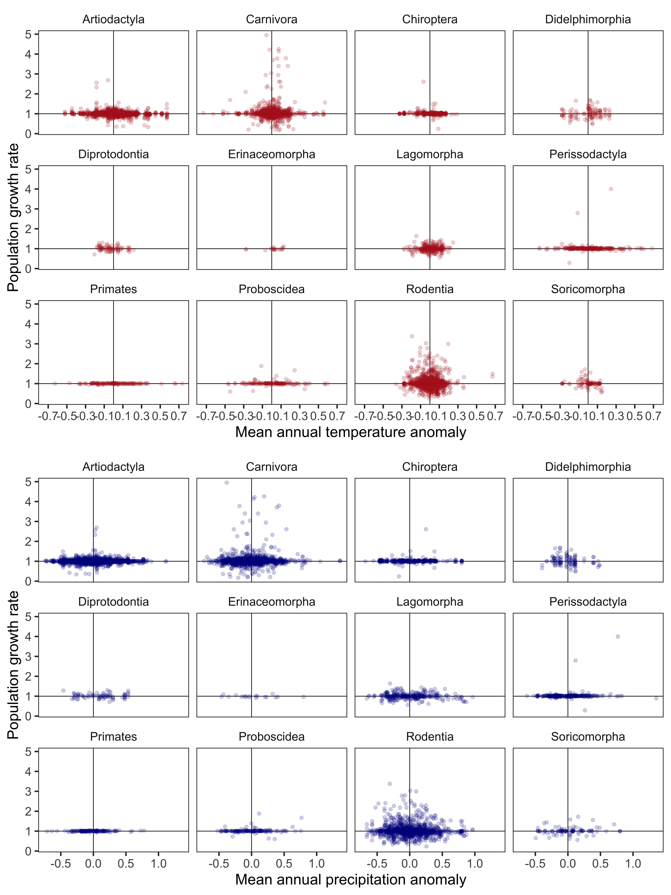
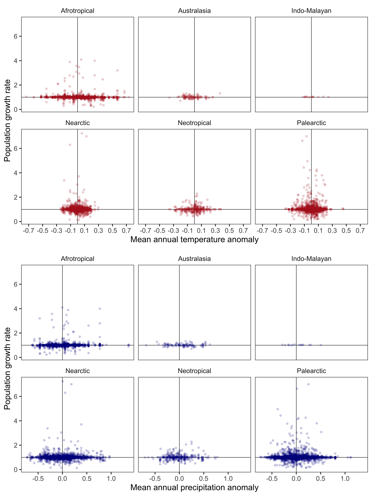
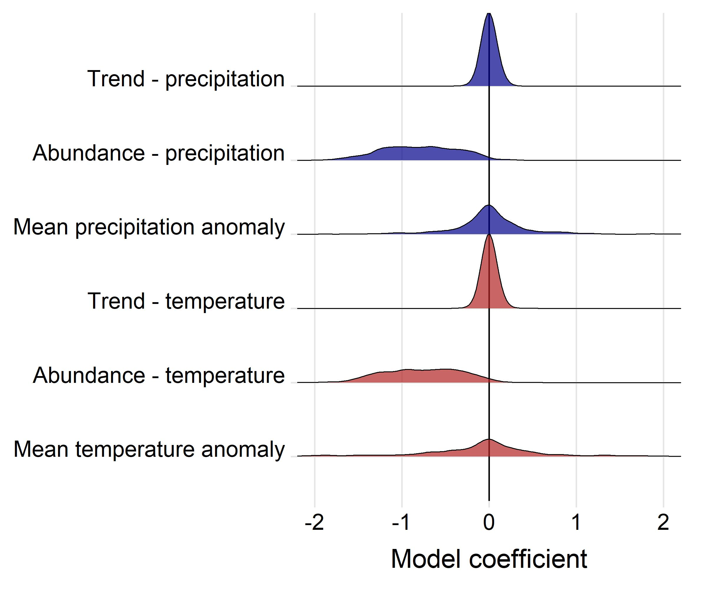
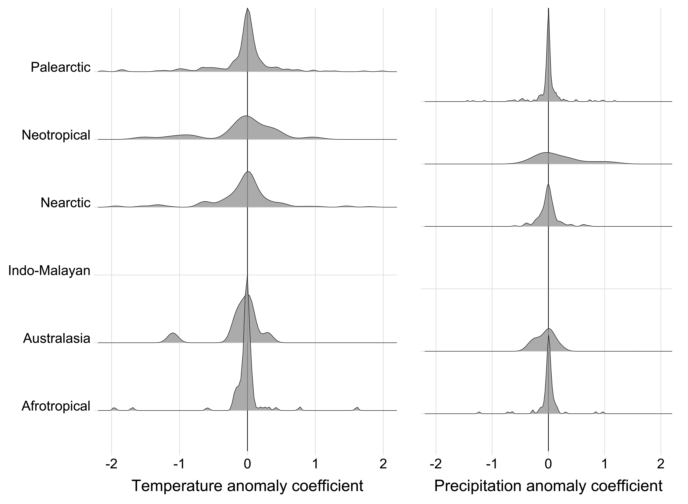

# Weather effects on population growth rates for the terrestrial mammals

#### 2020-06-09
#### John Jackson

---

This markdown is intended as an accompaniment to the scripts contained within the directory `weather_population_growth`, to walk through the process of calculating the effect of annual weather on population growth rates for each timeseries record in the LPD for the terrestrial mammals. This serves as the first step in a two-step meta regression approach to explore global weather effects on population growth. Please refer to the scripts mentioned in each section of the markdown for full details on each section.

There are 2 main sections and scripts:

## 1. Annual mean weather anomalies
<details>
  <summary>Click here to expand</summary>

### `annual_mean_anomaly.R`

First, we will walk through the process for calculating weather effects using the mean annual weather anomaly for a 5km buffer radius around the study site to demonstrate the process before expanding this out to look across different radius sizes and for different weather variables. We need to join the annual chelsa anomaly data with our population growth data first:

```
##__________________________________________________________________________________________________
#### 1. Load data ####

# mammal data
load("../rawdata/mammal.RData")
glimpse(mammal)

# annual weather anomaly - focus on just the mean anomaly in this script at a 5km range
mam_chelsa_annual <- readRDS("data/mam_chelsa_annual.RDS") %>% 
  filter(scale == "scale_5km") %>% 
  dplyr::select(ID,year, weather_scale = scale, mean_temp_anomaly, mean_precip_anomaly)
glimpse(mam_chelsa_annual)

##__________________________________________________________________________________________________
#### 2. Joining data ####

mammal_weather <- mammal %>% 
  left_join(., y = mam_chelsa_annual, by = c("ID", "year"))
```

Now using the raw data here, we can begin to explore some of the hypotheses of our study. We want to see if there are consistent weather effects on population growth rates across taxa or spatial scales. We can plot out the population growth rate in each year with respect to the taxanomic Order of the corresponding species and the ecological realm.




There doesn't seem to be an obvious pattern across realms or taxa, which is perhaps what we expect.

### Calculating weather effects on population growth rate

Now, we want to look at this hypothesis explictly using the timeseries data from each study, whilst accounting for density dependence and any temporal trends in the data. We estimate weather effects on population growth rate for each record using a linear model. Here, the population growth rate *r* at time *t* is given by


where beta 0 is the intercept, omega (*w*) gives the weather variable at time *t* with coefficient beta 1, X gives the *ln* abundance at time *t* with coefficient beta 2, and y gives the year at time *t* with coefficient beta 3. Thus, this linear model estimates the effect of weather, density dependence and the trend on population growth rates, respectively. In this script, the weather variable is the annual mean temperature and precipitation anomaly at a 5km buffer radius. We calculated linear models and extracted the beta coefficients as follows:

```
pgr_weather <- mammal_weather %>% 
  group_by(ID_block) %>% 
  group_modify(~{
    
    # Temperature
    mod_temp = lm(pop_growth_rate ~ mean_temp_anomaly + ln_abundance + year, data = .)
    
    # Precipitation + dealing with NA values
    if(length(which(is.na(.$mean_precip_anomaly) == T)) == 0){
    mod_precip = lm(pop_growth_rate ~ mean_precip_anomaly + ln_abundance + year, data = .)
    coef_precipmod = mod_precip$coefficients}
    else{coef_precipmod = rep(NA,4)}
    
    tibble(.[1,],
           coef_temp = mod_temp$coefficients[2],
           coef_precip = coef_precipmod[2],
           coef_abun = mod_temp$coefficients[3], 
           coef_trend = mod_temp$coefficients[4],
           
           coef_abun2 = coef_precipmod[3], 
           coef_trend2 = coef_precipmod[4],
           n_obs = nrow(.))
  }) 
```

Note that we extract coefficients for the abundance and the year for both temperature and precipitation. These are largely very similar, but vary based on the differences in the weather effect.

Now we have model coefficients for each of the 501 10> year records for the terrestrial mammals. We can now look at comparative patterns in these coefficients. First, the overall density distributions of each of the coefficients across the records



As with the raw data, we can see again from this that there doesn't seem to be a consistent pattern of weather effects on population growth rates for either precipitation or temperature. The same goes for trend effects. This is indicative of population-specific (or other level i.e phylogentic or spatial) responses. 

We can also start to explore the hypotheses of the study by looking at these coefficients across different taxanomic groups, ecological realms and latitude.





These coefficients or effects sizes form the basis of our meta-regression approach across taxa.

</details>

## 2. Other annual weather variables
<details>
  <summary>Click here to expand</summary>

</details>