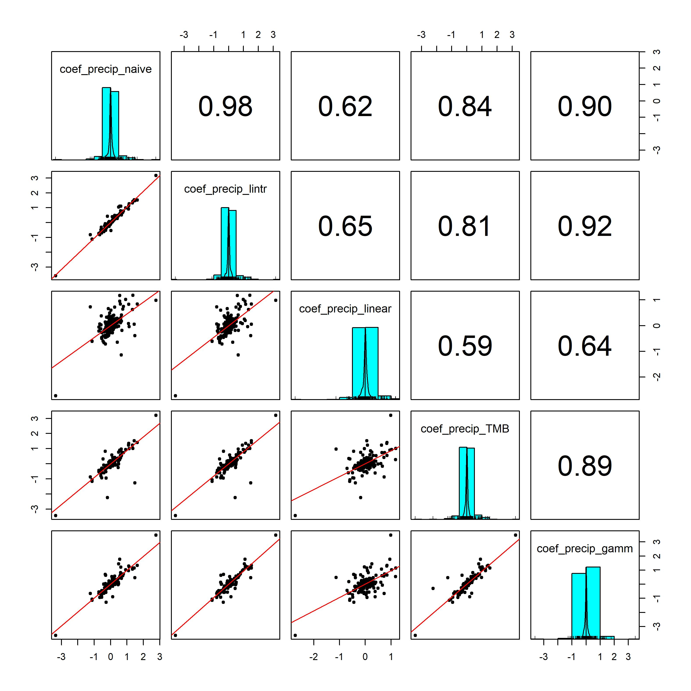
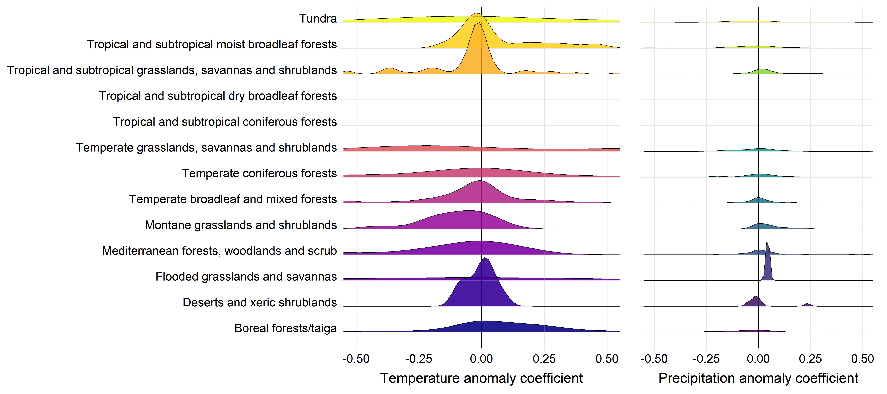
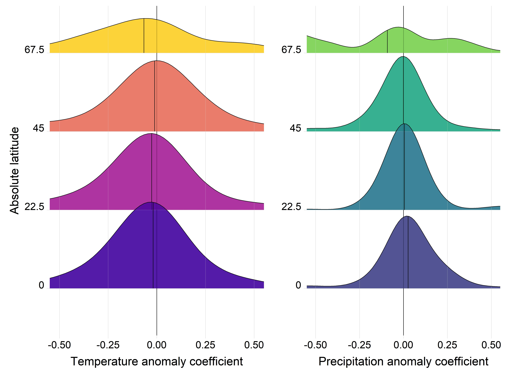
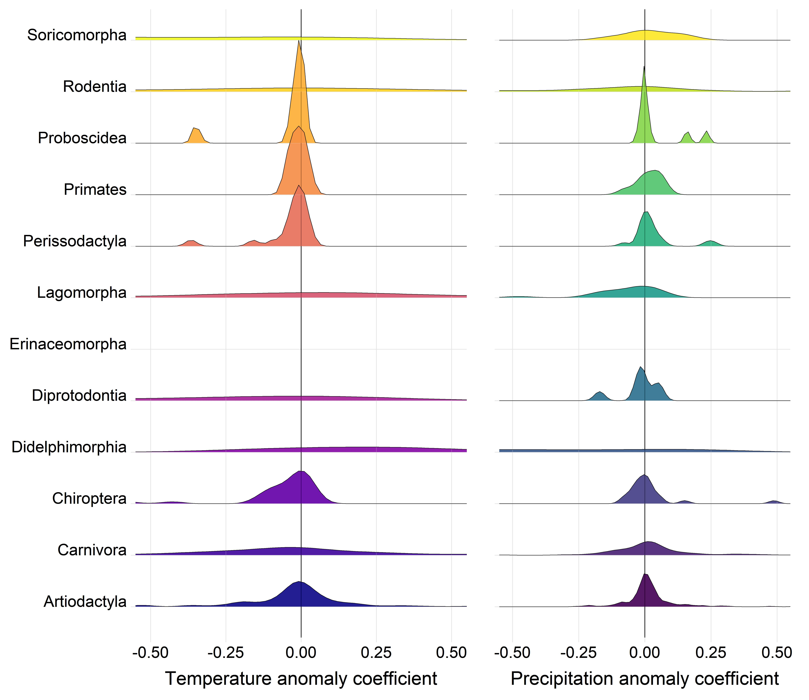

# Weather effects on population growth rates for the terrestrial mammals

#### 2021-09-23
#### John Jackson

---

This markdown is intended as an accompaniment to the scripts contained within the directory `weather_population_growth`, to walk through the process of calculating the effect of annual weather on population growth rates for each timeseries record in the LPD for the terrestrial mammals. This serves as the first step in a two-step meta regression approach to explore global weather effects on population growth. Please refer to the scripts mentioned in each section of the markdown for full details on each section.

There are 4 main sections and scripts:

## 1. Annual mean weather anomalies with GAM models
<details>
  <summary>Click here to expand</summary>

### `GAM_weather_pop_growth_meananomaly.R`

First, we will walk through the process for calculating weather effects using the mean annual weather anomaly for a 5km buffer radius around the study site to demonstrate the process before expanding this out to look across different radius sizes, for different weather variables, and using different methods (with different levels of naivety) for estimated weather effects. Our main models here are GAMs, which have a low basis-dimension smoothing term for year and an explicit ARMA autoregressive error structure (AR 1) to account for temporal autocorrelation. 

We need to join the annual CHELSA anomaly data with our population growth data first:

```
##__________________________________________________________________________________________________
#### 1. Load data ####

# mammal data
load("../rawdata/mammal.RData")
glimpse(mammal)

# annual weather anomaly - focus on just the mean anomaly in this script at a 5km range
mam_chelsa_annual <- readRDS("data/mam_chelsa_annual.RDS") %>% 
  filter(scale == "scale_5km") %>% 
  dplyr::select(ID,year, weather_scale = scale, mean_temp_anomaly, mean_precip_anomaly)
glimpse(mam_chelsa_annual)

# Species names to merge
load("../rawdata/GBIF_species_names_mamUPDATE.RData", verbose = TRUE)

##__________________________________________________________________________________________________
#### 2. Joining data ####

# linking to weather data and species names 
mammal_weather <- mammal %>% 
  left_join(., y = mam_chelsa_annual, by = c("ID", "year")) %>% 
  left_join(., y = dplyr::select(lpd_gbif, Binomial, gbif_species = gbif.species.tree),
            by = "Binomial") %>% 
  mutate(year_s = as.numeric(scale(year)))
```

### Calculating weather effects on population growth rate

Now, we want to look at this hypothesis explictly using the timeseries data from each study, whilst accounting forany temporal trends in the data, and also temporal autocorrelation. We estimate weather effects on population growth rate for each record using generalised additive models (GAMs) from package `mgcv`. Here, the population growth rate lambda at time *t* is given by


where beta 0 is the intercept, w gives the weather variable at time *t* with weather coefficient omega, and *f(y_t)* is smoothing term for the year (y) at time *t*. The smoothing term was fit with a thin plate regression spline with a basis dimension of 5, and an explicit ARMA autoregressive correlation structure of order one specified in the `nlme` package. This smoothing term serves two purposes: first, it accounts for trends in abundance through time, and second it specifically incorporates temporal autocorrelation. Thus, these models estimate the effect of weather whilst accounting for abundance trends and temporal autocorrelation respectively. GAMs were also fit using restricted maximum likelihood (REML). In this script, the weather variable is the annual mean temperature and precipitation anomaly at a 5km buffer radius. We estimated the GAM models and extracted the beta coefficients as follows:

```
pgr_weather_gam <- mammal_weather %>% 
  group_by(ID_block) %>% 
  group_modify(~{
    
    # Temperature
    mod_temp = gamm(pop_growth_rate ~ s(year, bs = "tp", k = 5) + mean_temp_anomaly,
                    data = ., family = gaussian,
                    correlation = corARMA(form = ~ year, p = 1),
                    method = "REML")
    coef_tempmod = coef(mod_temp$gam)
    
    # Precipitation + dealing with NA values
    if(length(which(is.na(.$mean_precip_anomaly) == T)) == 0){
      mod_precip = gamm(pop_growth_rate ~ s(year, bs = "tp", k = 5) + mean_precip_anomaly,
                        data = ., family = gaussian,
                        correlation = corARMA(form = ~ year, p = 1),
                        method = "REML")
      coef_precipmod = coef(mod_precip$gam)}
    else{coef_precipmod = rep(NA,15)}     # Arbitrary long NA vector
    
    tibble(.[1,],
           coef_temp = unname(coef_tempmod[2]),
           coef_precip = unname(coef_precipmod[2]),
           n_obs = nrow(.))
  }) 
```

Now we have model coefficients for each of the 494 10> year records for the terrestrial mammals (not final sample size as we have not intersected with life-history yet). We can now look at comparative patterns in these coefficients. First, lets look at the overall density distributions of the coefficients across the records. Here you can see ridge density plots for each of the coefficient, with coefficients between -1 and 1 shown here. **It is important to note that coefficients can be much larger, and this restriction is to better display the density distribution**.


We can see that there doesn't seem to be a consistent pattern of weather effects on population growth rates for either precipitation or temperature.  

</details>

## 2. Other annual weather variables and scales
<details>
  <summary>Click here to expand</summary>

### `GAM_weather_pop_growth_ALLweathervars.R`

Now we want to repeat the same GAM modelling framework but expand to calculate coefficients for all of our annual weather variables and spatial scales. We begin in very much the same way, but don't exclude any of the spatial scales or weather variables.

```
##__________________________________________________________________________________________________
#### 1. Load data ####

# mammal data
load("../rawdata/mammal.RData")
glimpse(mammal)

# annual weather anomaly - focus on just the mean anomaly in this script at a 5km range
mam_chelsa_annual <- readRDS("data/mam_chelsa_annual.RDS") %>% 
  dplyr::select(-c(4:6))
glimpse(mam_chelsa_annual)

##__________________________________________________________________________________________________
#### 2. Joining data ####

mammal_weather <- mammal %>% 
  left_join(., y = mam_chelsa_annual, by = c("ID", "year"))

```

To estimate weather effects for each record, we iterate through weather variables and spatial scales for each, fit a GAM model that also incorporates trend and temporal autocorrelation (as above), and extract the weather effects. 

```
##__________________________________________________________________________________________________
#### 3. GAMs for each variable and scale for each record ####

# 3a. set up iteration data
# Ignoring number of odd days vars for now - they follow a zero inflated pattern
iter_dat <- expand_grid(ID_block = unique(mammal_weather$ID_block),
                               scale = unique(mammal_weather$scale),
                               weather_var = colnames(mammal_weather)[24:39])

# 3b. weather coefficients for each variable
pgr_weather_res <- bind_rows(lapply(X = 1:nrow(iter_dat), function(x){
  
  crow = iter_dat[x,]
  
  # current data
  cdat = mammal_weather %>% 
    filter(ID_block == crow$ID_block, scale == crow$scale) %>% 
    dplyr::select(ID_block, year, ln_abundance,
                  weather_val = crow$weather_var,
                  pop_growth_rate)
  
  # record info
  rec_info = mammal_weather %>% 
    filter(ID_block == crow$ID_block, scale == crow$scale) %>% 
    dplyr::select(2:17) %>% 
    slice(1)
  
  # model
  if(length(which(is.na(cdat$weather_val) == T)) > 0){modcoef = rep(NA,4)}
  else{mod_weather = gamm(pop_growth_rate ~ 
                            s(year, bs = "tp", k = 5) + weather_val,
                          data = cdat, 
                          family = gaussian,
                          correlation = corARMA(form = ~ year, p = 1),
                          method = "REML")
       modcoef = coef(mod_weather$gam)}
  
  # returning data
  cat('\r',"Your Job is",round((x/nrow(iter_dat))*100, 0),"% Complete       ")
  return(tibble(crow, coef_weather = modcoef[2], 
                rec_info))
}))
  
# 3c. Adding in weather variable labels
pgr_weather_res <- pgr_weather_res %>% 
  mutate(weather_var_lab = stringr::str_to_sentence(gsub("_", " ", weather_var))) %>% 
  mutate(weather_var_lab = gsub("emp", "emperature", weather_var_lab),
         weather_var_lab = gsub("recip", "recipitation", weather_var_lab))
```

This gives us weather coefficients for each variable and scale of our 494 records. Assuming first that all spatial scales are ~identical in their effect size, here we plot the density of the weather coefficient for each of the weather variables. This shows that coefficients of weather effects are largely very small across records. However, there are some cases with large weather coefficients and some distributions that suggest there may be patterns.


We can also have a look at how the weather coefficients we obtained are different based on the buffer radius or spatial scale that was chosen. Below we can see a pairs.panel plot that displays the correlations in all weather coefficients between the scales. You can see that they are virtually identical.


### Variance in weather `GAM_weather_variance_pop_growth.R`

An important feature of responses to the environment is that species may be more responsive to variance in the environment rathe than the central tendency i.e. a mean annual temperature anomaly of 0 may not reflect the fact that in reality there were big fluctuations in the monthly weather variables. Therefore, we repeat the process highlighted in step 1 using the 5km buffer radius, but this time using weather variance.

If we refer to `weather_variables/annual_weather_variables.R` in the root github repository (i.e. section 2 of the main workflow), we calculate the weather variance of the raw monthly temperature and precipitation variables such that:

```
# Weather variance
temp_variance = var(temp)
precip_variance = var(precip)
```
Apart from this, the framework for estimating the weather effects on population growth rates is identical using the GAM model. Please see `GAM_weather_variance_pop_growth.R` for the full details.

</details>

## 3. Model comparison
<details>
  <summary>Click here to expand</summary>

### `weather_popgrowth_method_comparison.R`

To test the implications of our choice of GAMs for modelling the underlying patterns of weather effects on population growth rates, we performed a method comparison for different ways of assessing the weather effects. We evaluated a set of six candidate models for estimating the weather effects, which were as follows:

1. A fully naive linear model only including the weather effect.
2. A linear model accounting for the trend in population growth rate.
3. A linear model incorporating trend and the previous years abundance.
4. A glmmTMB model with an autoregressive term for year of order AR(1).
5. A GAM with a corse smoothing term for the year trend and an autoregressive term for year of order AR(1)
6. A state-space model incorporating process and observation error.

The first five models were specified generally as follows:

```
    #_______________________________________________
    # Temperature
    
    # Model 1. Fully naive model - simple linear regression
    temp_naive = lm(pop_growth_rate ~ mean_temp_anomaly, data = .)
    coef_temp_naive = coef(temp_naive)[2]
    
    # Model 2. Linear regression accounting for trend 
    temp_lintr = lm(pop_growth_rate ~ mean_temp_anomaly + year, data = .)
    coef_temp_lintr = coef(temp_lintr)[2]
    
    # Model 3. Linear regression with trend and past abundance
    temp_linear = lm(pop_growth_rate ~ mean_temp_anomaly + ln_abundance + year, data = .)
    coef_temp_linear = coef(temp_linear)[2]
    
    # Model 4. glmmTMB with autoregression(1) for year
    temp_TMB = glmmTMB(pop_growth_rate ~ mean_temp_anomaly + ar1(as.factor(year_f) + 0 | ID), 
                       family = 'gaussian', data = .)
    coef_temp_TMB = as.numeric(coef(temp_TMB)$cond$ID[length(coef(temp_TMB)$cond$ID)])
    
    # Model 5. GAMM with a coarse year smoothing term and an autoregression (1) correlation structure 
    temp_gamm = gamm(pop_growth_rate ~ s(year, bs = "tp", k = 5) + mean_temp_anomaly,
                    data = ., family = gaussian,
                    correlation = corARMA(form = ~ year, p = 1),
                    method = "REML")
    coef_temp_gamm = coef(temp_gamm$gam)[2]
    
    #_______________________________________________
    # Precipitation
    if(length(which(is.na(.$mean_precip_anomaly) == T)) == 0){
      
      # Model 1. Fully naive model - simple linear regression
      precip_naive = lm(pop_growth_rate ~ mean_precip_anomaly, data = .)
      coef_precip_naive = coef(precip_naive)[2]
      
      # Model 2. Linear regression accounting for trend 
      precip_lintr = lm(pop_growth_rate ~ mean_precip_anomaly + year, data = .)
      coef_precip_lintr = coef(precip_lintr)[2]
      
      # Model 3. Linear regression with trend and past abundance
      precip_linear = lm(pop_growth_rate ~ mean_precip_anomaly + ln_abundance + year, data = .)
      coef_precip_linear = coef(precip_linear)[2]
      
      # Model 4. glmmTMB with autoregression(1) for year
      precip_TMB = glmmTMB(pop_growth_rate ~ mean_precip_anomaly + ar1(as.factor(year_f) + 0 | ID), 
                         family = 'gaussian', data = .)
      coef_precip_TMB = as.numeric(coef(precip_TMB)$cond$ID[length(coef(precip_TMB)$cond$ID)])
      
      # Model 5. GAMM with a coarse year smoothing term and an autoregression (1) correlation structure 
      precip_gamm = gamm(pop_growth_rate ~ s(year, bs = "tp", k = 5) + mean_precip_anomaly,
                       data = ., family = gaussian,
                       correlation = corARMA(form = ~ year, p = 1),
                       method = "REML")
      coef_precip_gamm = coef(precip_gamm$gam)[2]}
```
And we also then explore the relationships between the different methods of calculating weather effects. Here we look at the pairwise correlation plot for all of the coefficients for temperature:


And for precipitation:



You can see that in particular for the GAM approach taken in this study, it was a good representation of the weather coefficients for both temperature and precipitation relative to other methods. And, as with our density dependence simulation in the previous section, we see that weather coefficients (environmental effects) are highly correlated even when we don't account for temporal autocorrelation or trend. The only exception to these reassuring findings is the glmmTMB method, which is not as well correlated. However these coefficients are still well related to the GAM coefficients.

Now for the state-space approach

### `varying_methods_individual/state_space_weather_popgrowth.R`

In addition to the generalised linear approaches taken here, a common approach to handle time-series data is to use state-space models, which enable explicit auto-regressive time-series models to be fit using a Bayesian framework. Crucially, this approach also enables the incorporation of specific terms for observation and process error in the time-series. This approach was implemented here in `JAGS` using the `jagsUI` package. The general JAGs code to fit the state-space model is as follows:

```
model {
  
  # Priors and constraints
  logN[1] ~ dnorm(5.6, 0.01)           # Prior for initial population size
  b0 ~ dnorm(0, 0.001)                 # Prior for mean growth rate
  beta ~ dnorm(0, 0.001)               # Prior for slope parameter
  sigma.proc ~ dunif(0, 1)             # Prior for sd of state process
  sigma2.proc <- pow(sigma.proc, 2)
  tau.proc <- pow(sigma.proc, -2)
  sigma.obs ~ dunif(0, 1)              # Prior for sd of observation process
  sigma2.obs <- pow(sigma.obs, 2)
  tau.obs <- pow(sigma.obs, -2)
  
  # Likelihood
  # State process
  for (t in 1:(T-1)){
    r[t] <- b0 + beta * x[t] + epsilon[t]   # Linear model for the population growth rate
    epsilon[t] ~ dnorm(0, tau.proc)         # Random noise of the population growth rate
    logN[t+1] <- logN[t] + r[t]
  }
  # Observation process
  for (t in 1:T) {
    y[t] ~ dnorm(logN[t], tau.obs)
  }
  
  # Population sizes on real scale
  for (t in 1:T) {
    N[t] <- exp(logN[t])
  }
  }
```

Here the weather effect on population growth rate is captured with the `beta` term for each timeseries. Application of this approach across all timeseries revealed a close correlation between GAM models and the state-space approach:


The state-space approach also had a strong fit-to-sample:


</details>

## 4. Hypothesis exploration plots
<details>
  <summary>Click here to expand</summary>

### `hypothesis_exploration/`

With a weather effect for each record, we can start to explore the hypotheses of the study by looking at these coefficients across different taxanomic groups, ecological biomes, latitudes, and with respect to life-history variables. Please refer to the scripts in the `hypothesis_exploration/`.

### Spatial variables

Here we look at the distribution of the weather coefficients with respect to the biome and the latitude, both of which are often important in macro-ecological patterns. We would predict that generally, as the climate is more stable in tropical regions, the magnitude population responses to weather at low latitudes and tropical biomes is lower, with more extreme population changes in regions where weather is more changeable. However, exactly because the climate is more stable, we may also expect the opposite.




It does certainly look like there are some biomes with more extreme population responses to the weather. Furthermore there seems to be  wider spread of population responses at the most extreme latitudes.

### Evolutionary history

We also could predict that different taxonomic groups, and shared evolutionary history may be responsible for an organisms response to the weather, due to shared adaptation to changes in the environment. Here you have the coefficients distributions for each order of mammals in the study.



We can also look at how these weather coefficients are distributed around the phylogenetic tree for the mammals. Do we see covariance in population responses to weather between closely related species?


### Life-history

We also may expect that demographic traits, and traits related to an organisms mode of life, their life-history, has a part to play in the response to changes in the weather. We can look at the temperature and precipitation coefficients with respect to our three key life-history variables maximum longevity, litter size and adult body mass. 


These coefficients or effects sizes form the basis of our meta-regression approach across taxa, where we will explore these coefficient patterns in detail.

</details>
