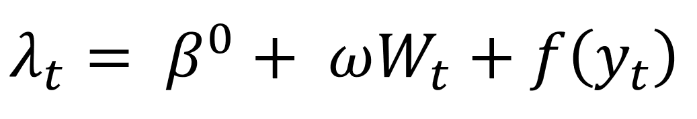
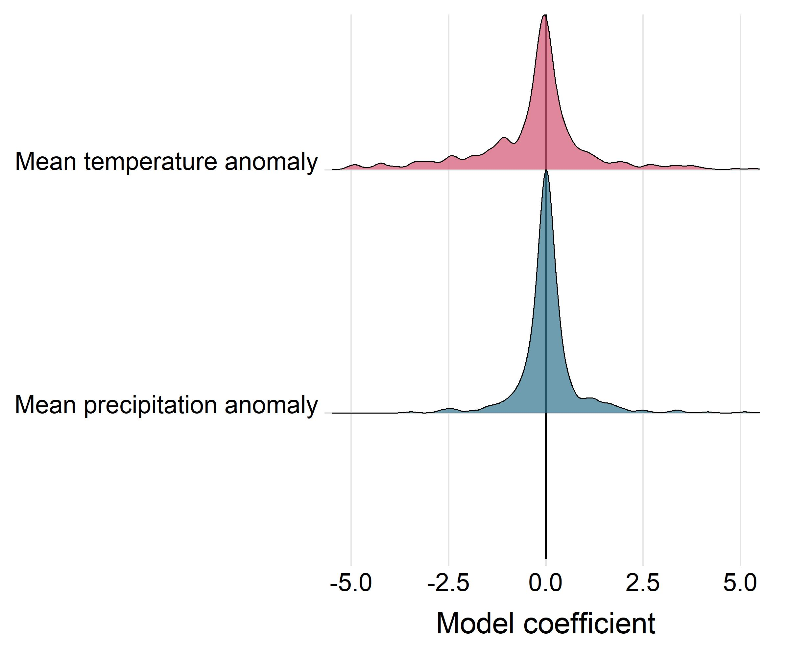
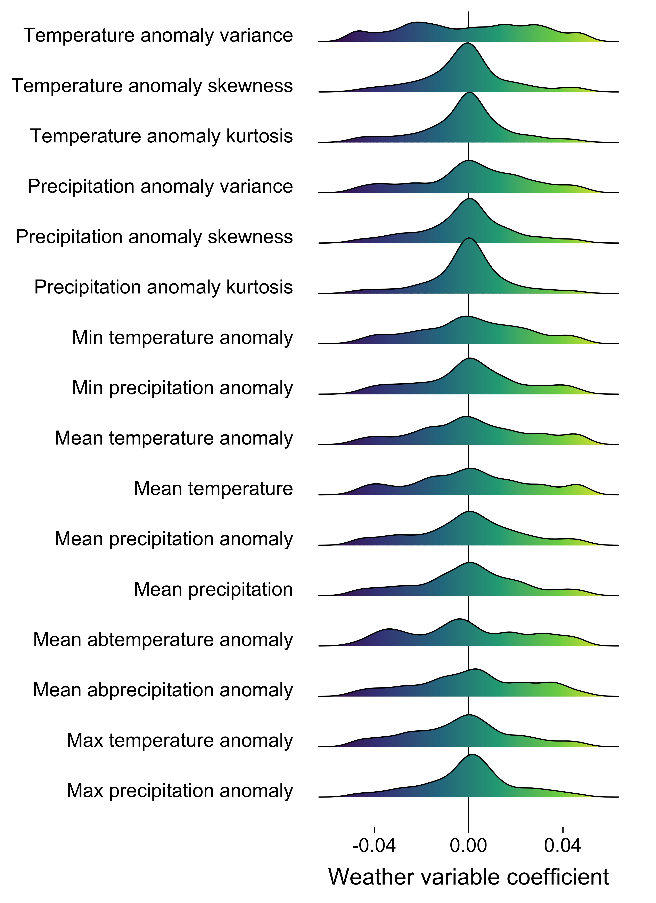
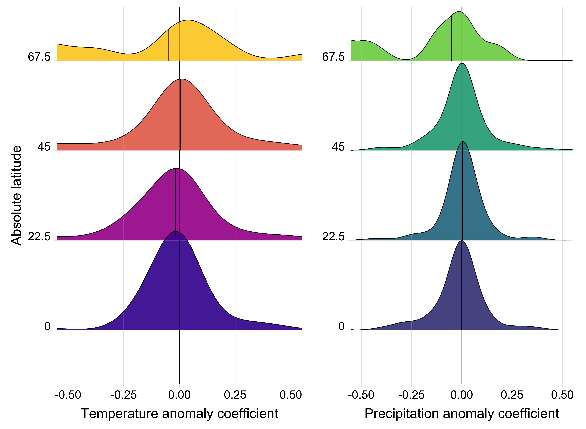
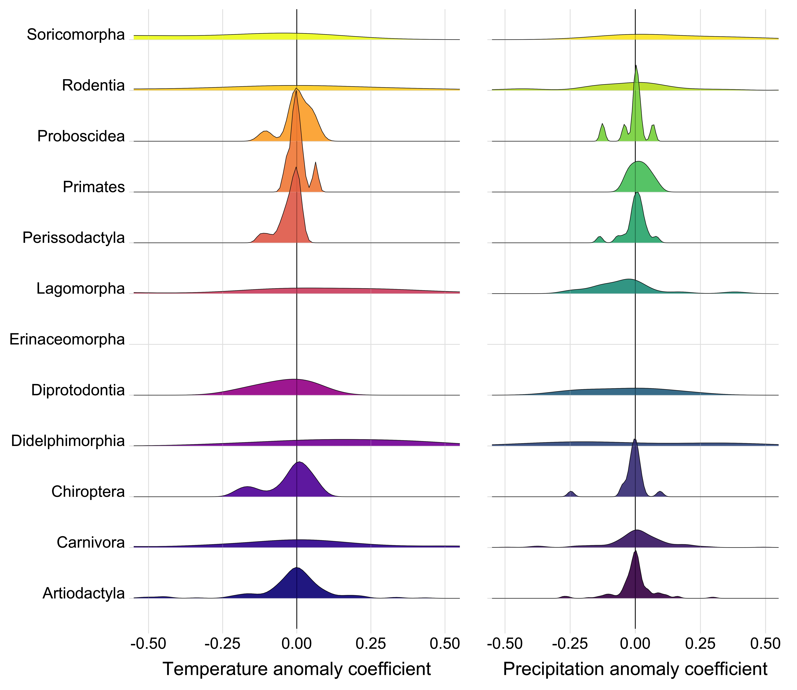
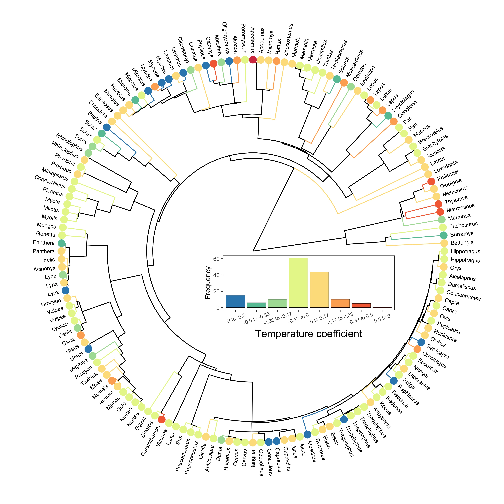
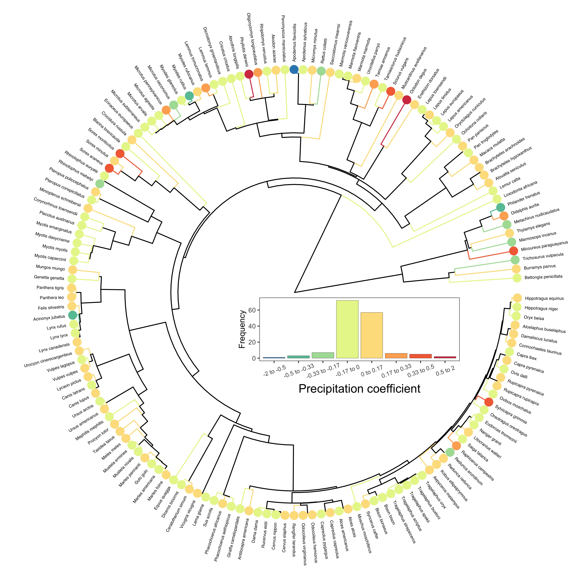
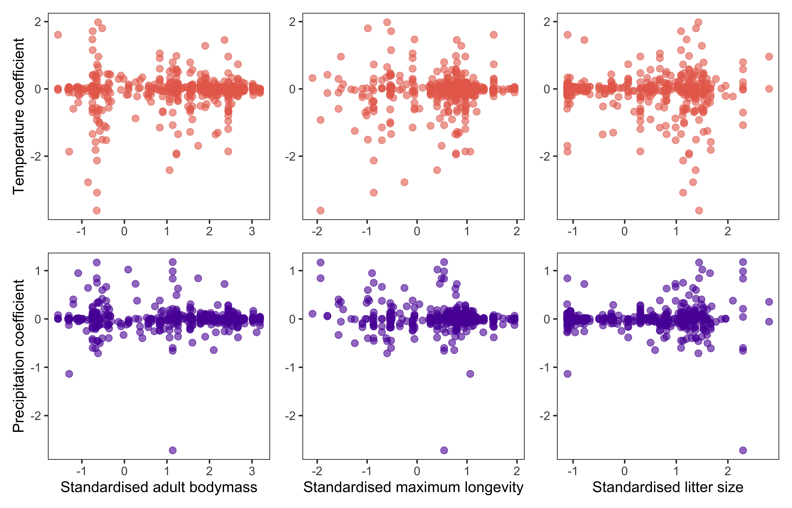

# Weather effects on population growth rates for the terrestrial mammals

#### 2021-03-16
#### John Jackson

---

This markdown is intended as an accompaniment to the scripts contained within the directory `weather_population_growth`, to walk through the process of calculating the effect of annual weather on population growth rates for each timeseries record in the LPD for the terrestrial mammals. This serves as the first step in a two-step meta regression approach to explore global weather effects on population growth. Please refer to the scripts mentioned in each section of the markdown for full details on each section.

There are 2 main sections and scripts:

## 1. Annual mean weather anomalies with GAM models
<details>
  <summary>Click here to expand</summary>

### `GAMM_ARMA_populationgrowth_rates.R`

First, we will walk through the process for calculating weather effects using the mean annual weather anomaly for a 5km buffer radius around the study site to demonstrate the process before expanding this out to look across different radius sizes, for different weather variables, and using different methods (with different levels of naivity) for estimated. We do this using a GAM model for each record, which accounts for a low basis-dimension smoothing term for year, which has an explicit ARMA autoregressive error structure (AR 1) to account for temporal autocorrelation. 

We need to join the annual CHELSA anomaly data with our population growth data first:

```
##__________________________________________________________________________________________________
#### 1. Load data ####

# mammal data
load("../rawdata/mammal.RData")
glimpse(mammal)

# annual weather anomaly - focus on just the mean anomaly in this script at a 5km range
mam_chelsa_annual <- readRDS("data/mam_chelsa_annual.RDS") %>% 
  filter(scale == "scale_5km") %>% 
  dplyr::select(ID,year, weather_scale = scale, mean_temp_anomaly, mean_precip_anomaly)
glimpse(mam_chelsa_annual)

# Species names to merge
load("../rawdata/GBIF_species_names_mamUPDATE.RData", verbose = TRUE)

##__________________________________________________________________________________________________
#### 2. Joining data ####

# linking to weather data and species names 
mammal_weather <- mammal %>% 
  left_join(., y = mam_chelsa_annual, by = c("ID", "year")) %>% 
  left_join(., y = dplyr::select(lpd_gbif, Binomial, gbif_species = gbif.species.tree),
            by = "Binomial") %>% 
  mutate(year_s = as.numeric(scale(year)))
```

### Calculating weather effects on population growth rate

Now, we want to look at this hypothesis explictly using the timeseries data from each study, whilst accounting forany temporal trends in the data, and also temporal autocorrelation. We estimate weather effects on population growth rate for each record using generalised additive models (GAMs) from package `mgcv`. Here, the population growth rate $\lambda$ at time $t$ is given by



where $\beta^{0}$ is the intercept, $W$ gives the weather variable at time $t$ with weather coefficient $\omega$, and $f(y_t)$ is smoothing term for the year ($y$) at time $t$. The smoothing term was fit with a thin plate regression spline with a basis dimension of 5, and an explicit ARMA autoregressive correlation structure of order one specified in the `nlme` package. This smoothing term serves two purposes: first, it accounts for trends in abundance through time, and second it specifically incorporates temporal autocorrelation. Thus, these models estimate the effect of weather whilst accounting for abundance trends and temporal autocorrelation respectively. GAMs were also fit using restricted maximum likelihood (REML). In this script, the weather variable is the annual mean temperature and precipitation anomaly at a 5km buffer radius. We estimated the GAM models and extracted the beta coefficients as follows:

```
pgr_weather_gam <- mammal_weather %>% 
  group_by(ID_block) %>% 
  group_modify(~{
    
    # Temperature
    mod_temp = gamm(pop_growth_rate ~ s(year, bs = "tp", k = 5) + mean_temp_anomaly,
                    data = ., family = gaussian,
                    correlation = corARMA(form = ~ year, p = 1),
                    method = "REML")
    coef_tempmod = coef(mod_temp$gam)
    
    # Precipitation + dealing with NA values
    if(length(which(is.na(.$mean_precip_anomaly) == T)) == 0){
      mod_precip = gamm(pop_growth_rate ~ s(year, bs = "tp", k = 5) + mean_precip_anomaly,
                        data = ., family = gaussian,
                        correlation = corARMA(form = ~ year, p = 1),
                        method = "REML")
      coef_precipmod = coef(mod_precip$gam)}
    else{coef_precipmod = rep(NA,15)}     # Arbitrary long NA vector
    
    tibble(.[1,],
           coef_temp = unname(coef_tempmod[2]),
           coef_precip = unname(coef_precipmod[2]),
           n_obs = nrow(.))
  }) 
```

Now we have model coefficients for each of the 494 10> year records for the terrestrial mammals. We can now look at comparative patterns in these coefficients. First, the overall density distributions of the coefficients across the records. Here you can see ridge density plots for each of the coefficient, with coefficients between -1 and 1 shown here. **It is important to note that coefficients can be much larger, and this restriction is to better display the density distribution**.



We can see that there doesn't seem to be a consistent pattern of weather effects on population growth rates for either precipitation or temperature.  

</details>

## 2. Other annual weather variables and scales
<details>
  <summary>Click here to expand</summary>

### `annual_weather_variables.R`

Now we want to repeat the same linear modelling framework but expand to calculate coefficients for all of our annual weather variables and spatial scales. We begin in very much the same way, but don't exclude any of the spatial scales or weather variables.

```
##__________________________________________________________________________________________________
#### 1. Load data ####

# mammal data
load("../rawdata/mammal.RData")
glimpse(mammal)

# annual weather anomaly - focus on just the mean anomaly in this script at a 5km range
mam_chelsa_annual <- readRDS("data/mam_chelsa_annual.RDS") %>% 
  dplyr::select(-c(4:6))
glimpse(mam_chelsa_annual)

##__________________________________________________________________________________________________
#### 2. Joining data ####

mammal_weather <- mammal %>% 
  left_join(., y = mam_chelsa_annual, by = c("ID", "year"))

```

To estimate weather effects for each record, we iterate through weather variables and spatial scales for each, fit a linear model that also incorporates density dependence and trend effects (as above), and extract the weather effects. 

```
##__________________________________________________________________________________________________
#### 3. Linear models for each variable and scale for each record ####

# 3a. set up iteration data
# Ignoring number of odd days vars for now - they follow a zero inflated pattern
iter_dat <- expand_grid(ID_block = unique(mammal_weather$ID_block),
                               scale = unique(mammal_weather$scale),
                               weather_var = colnames(mammal_weather)[24:39])

# 3b. weather coefficients for each variable
pgr_weather_res <- bind_rows(lapply(X = 1:nrow(iter_dat), function(x){
  
  crow = iter_dat[x,]
  
  # current data
  cdat = mammal_weather %>% 
    filter(ID_block == crow$ID_block, scale == crow$scale) %>% 
    dplyr::select(ID_block, year, ln_abundance,
                  weather_val = crow$weather_var,
                  pop_growth_rate)
  
  # record info
  rec_info = mammal_weather %>% 
    filter(ID_block == crow$ID_block, scale == crow$scale) %>% 
    dplyr::select(2:17) %>% 
    slice(1)
  
  # model
  if(length(which(is.na(cdat$weather_val) == T)) > 0){modcoef = rep(NA,4)}
  else{mod_weather = lm(pop_growth_rate ~ weather_val + ln_abundance + year, data = cdat)
       modcoef = coefficients(mod_weather)}
  
  # returning data
  cat('\r',"Your Job is",round((x/nrow(iter_dat))*100, 0),"% Complete       ")
  return(tibble(crow, coef_weather = modcoef[2], 
                coef_abun = modcoef[3], coef_trend = modcoef[4],
                rec_info))
}))
  
# 3c. Adding in weather variable labels
pgr_weather_res <- pgr_weather_res %>% 
  mutate(weather_var_lab = stringr::str_to_sentence(gsub("_", " ", weather_var))) %>% 
  mutate(weather_var_lab = gsub("emp", "emperature", weather_var_lab),
         weather_var_lab = gsub("recip", "recipitation", weather_var_lab))
```

This gives us weather coefficients for each variable and scale of our 502 records. Assuming first that all spatial scales are ~identical in their effect size, here we plot the density of the weather coefficient for each of the weather variables. This shows that coefficients of weather effects are largely very small across records. However, there are some cases with large weather coefficients and some distributions that suggest there may be patterns.



We can also have a look at how the weather coefficients we obtained are different based on the buffer radius or spatial scale that was chosen. Below we can see a pairs.panel plot that displays the correlations in all weather coefficients between the scales. You can see that they are virtually identical.


Finally, we want to look at whether the abundance and trend coefficients calculated when each weather variable was in the model are consistent across the weather variables. Here we have a correlation matrix for the abundance (left) and trend (right) coefficients for all 16 weather variables. You can see that they are very highly correlated across weather variables.


</details>


## 3. Hypothesis exploration plots plots
<details>
  <summary>Click here to expand</summary>
  
With weather effect for each record, we can start to explore the hypotheses of the study by looking at these coefficients across different taxanomic groups, ecological biomes, latitudes, and with respect to life-history variables.

### Spatial variables

Here we look at the distribution of the weather coefficients with respect to the biome and the latitude, both of which are often important in macro-ecological patterns. We would predict that generally, as the climate is more stable in tropical regions, the magnitude population responses to weather at low latitudes and tropical biomes is lower, with more extreme population changes in regions where weather is more changeable. However, exactly because the climate is more stable, we may also expect the opposite.




It does certainly look like there are some biomes with more extreme population responses to the weather. Furthermore there seems to be  wider spread of population responses at the most extreme latitudes.

### Evolutionary history

We also could predict that different taxonomic groups, and shared evolutionary history may be responsible for an organisms response to the weather, due to shared adaptation to changes in the environment. Here you have the coefficients distributions for each order of mammals in the study.



We can also look at how these weather coefficients are distributed around the phylogenetic tree for the mammals. Do we see covariance in population responses to weather between closely related species?




It seems in the case of temperature that there may be some cases where there is some covariance between the population responses of closes related taxa (particularly in the top left with the rodents). However, generally these patterns are hard to decipher.

### Life-history

We also may expect that demographic traits, and traits related to an organisms mode of life, their life-history, has a part to play in the response to changes in the weather. We can look at the temperature and precipitation coefficients with respect to our three key life-history variables maximum longevity, litter size and adult body mass.



Again it is hard to say anything clear from this, but there may be some patterns worth exploring.

These coefficients or effects sizes form the basis of our meta-regression approach across taxa, where we will explore these coefficient patterns in detail.

</details>
