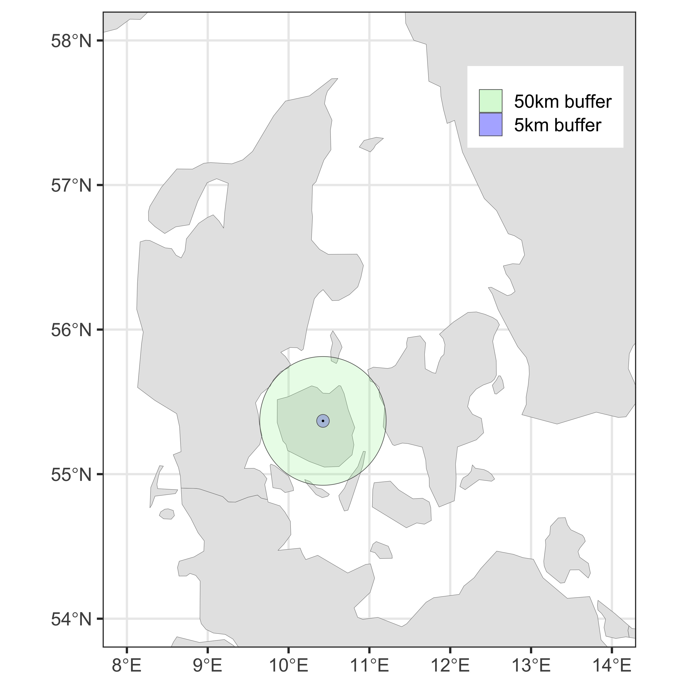
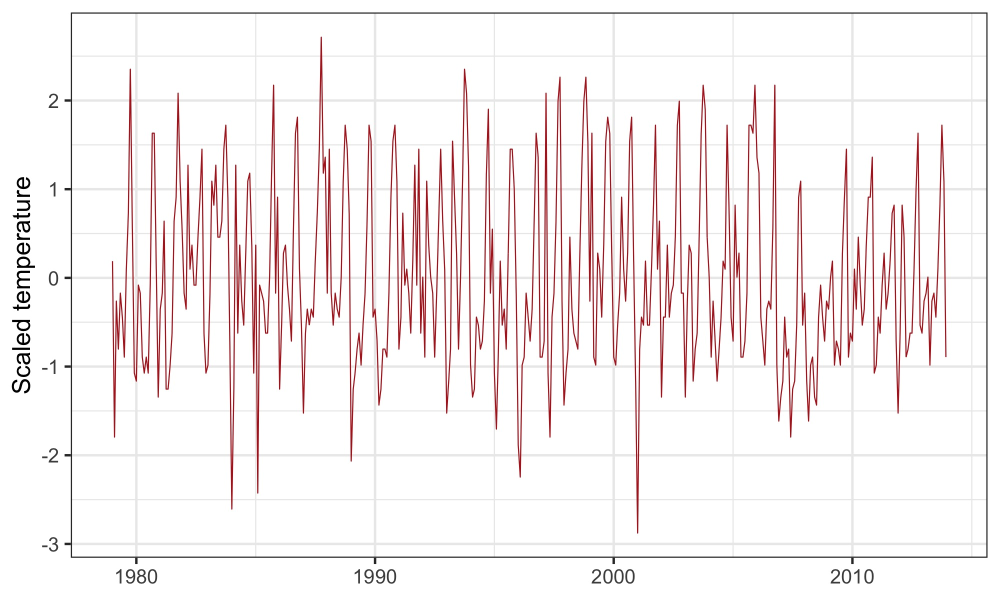
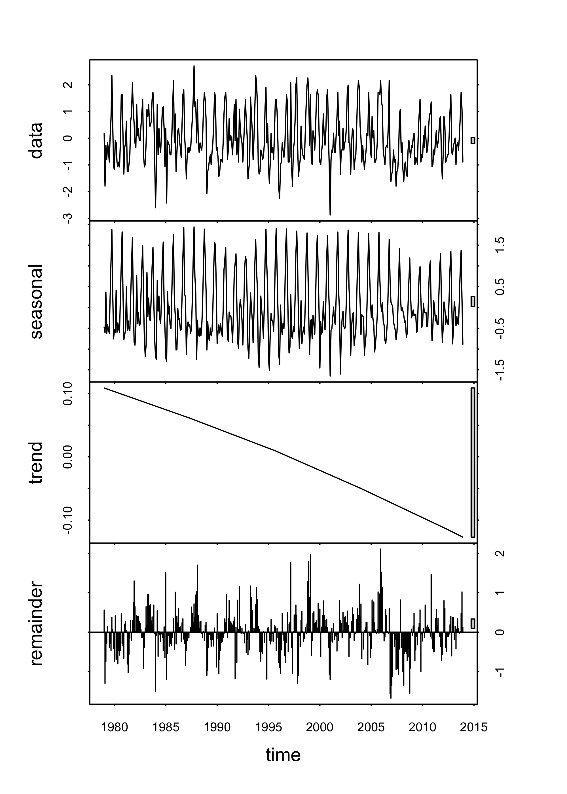

# Developing annual weather variables

#### 2020-05-01 
#### John Jackson

---

This mardown is intended as an accompaniment to the scripts contained within the directory `weather_variables/`, to walk through obtaining annual weather variables from raw CHELSA data for the localities of the living planet database studies for the terrestrial mammals. Please refer to the scripts mentioned in each section of the markdown for full details on each section.

There are 3 main sections and scripts:

1. Extracting CHELSA data for the localities of the LPD studies `chelsa_extraction_pilot.R`
2. Decomposition of raw CHELSA data to obtain monthly weather anomalies `weather_decomposition.R`
3. Calculating annual weather variables `annual_weather_variables.R`

---

## 1. Extracting CHELSA data for the localities of the LPD studies
### `chelsa_extraction_pilot.R`

The first task is to extract values of temperature and precipitation from the CHELSA raster files for the localities of our studies. The limitation here is the computational intensity of extracting values from such large raster files. This issue is addressed neatly using methods of extraction from the `exactextractr` package alongside `raster`.

For the mammal data, we restricted the raw data to only include years that overlapped with the CHELSA data i.e. 1979-2013. Furthermore, for each of the studies that remained after this restrictions, we expanded the data out to inlclude all year-month combinations from 1979-2013 for each study. This to give us full timeseries to do decompositions and extract anomalies later on. The data looks like this:

```
## 1a. Mammal living planet data

glimpse(mam)
Rows: 480,060
Columns: 6
$ ID        <dbl> 28, 28, 28, 28, 28, 28, 28, 28, 28, 28, 28, 28, 28, 28, 28, 28, 28, 28, 28, 28,…
$ Binomial  <chr> "Acinonyx_jubatus", "Acinonyx_jubatus", "Acinonyx_jubatus", "Acinonyx_jubatus",…
$ Latitude  <dbl> -2.33333, -2.33333, -2.33333, -2.33333, -2.33333, -2.33333, -2.33333, -2.33333,…
$ Longitude <dbl> 34.58333, 34.58333, 34.58333, 34.58333, 34.58333, 34.58333, 34.58333, 34.58333,…
$ year      <int> 1979, 1979, 1979, 1979, 1979, 1979, 1979, 1979, 1979, 1979, 1979, 1979, 1980, 1…
$ month     <int> 1, 2, 3, 4, 5, 6, 7, 8, 9, 10, 11, 12, 1, 2, 3, 4, 5, 6, 7, 8, 9, 10, 11, 12, 1…
```

Where each study has a unique ID, is on a particular species (Binomial), and has location information in Latitiude and Longitude (although not necessarily specific location). Note that we also have year and month, which begins in January 1979 (the start of the study).

Then we set up a `files_df` data.frame, which stores the file paths, year and month of each of the rasters for indexing when we extract the data.

```
## 1b. CHELSA raster file lists

# from the UCloud - you select the files you want to use when creating the job
U_t <- "CHELSA/temperature"
U_p <- "CHELSA/precipitation"

files_temp <- paste(U_t, list.files(U_t), sep = "/")
files_precip <- paste(U_p, list.files(U_p), sep = "/")

files_df <- tibble(files_temp, files_precip) %>% 
  mutate(year = map_int(files_temp, ~ as.integer(strsplit(.x, "_")[[1]][3]))) %>% 
  mutate(month = map_int(files_temp, ~ as.integer(strsplit(.x, "_")[[1]][4])))
```
---

### Extract raster values

This part heavily uses Now we go through the files and find the studies in the mammal data that are associated with the year/month combination of that files_df row, and extract the CHELSA data for it. In the code below, x is the current row of the files_df data. Once we have the c_species (current species data) tibble and the rasters in chelsa_temp and chelsa_precip, we set the NA values of precipitation, which are those above 65000. Then, we have to convert the mammal data to the coordinate reference system of the raster files, which is *WGS84*. 

```
  # 1. extract the right data
  c_species = dplyr::filter(mam,
                            year == files_df[x,]$year,
                            month == files_df[x,]$month)
  
  chelsa_temp   = raster(x = files_df[x,]$files_temp)
  chelsa_precip = raster(x = files_df[x,]$files_precip)
  
  # incorporating NAs
  chelsa_precip[values(chelsa_precip) > 65000] = NA_real_
  
    # 2. Converting the species data to spatial data and aligning with CHELSA coordinate reference
  coordinates(c_species) = c("Longitude","Latitude")
  pbase = "+proj=longlat +datum=WGS84 +no_defs +ellps=WGS84 +towgs84=0,0,0"
  proj4string(c_species) = pbase
  c_species = spTransform(c_species, crs(chelsa_temp))
  

```
Then we extract the necessary data. The `raster` packages enable you to do this with square bracket indexing.

```
  #_________________________________________________________________________________________________
  # 3a. Extract the climate data from exact points- Takes a while
  cells_sp = cellFromXY(chelsa_temp, c_species)
  c_species$raster_cell = cells_sp
  c_species$temp = chelsa_temp[cells_sp] / 10 - 273.15 # Kelvin to celcius
  c_species$precip = chelsa_precip[cells_sp]
```
---

### Considering buffers

There are several potential problems with extracting just a single raster value for each mammal study in each month-year. The coordinates given in the data may not be in reference to the specific location of the population, and more just an indication of the general locacation of the study area. The location noted might also not be biologically relavent to the study species. For migratory species for example, a much broader climatic area my be covered by the population. 

Therefore, creating buffers of varying radius around each study site enables us to (partially) some of these spatial difficulties. The `rgeos` package gives us tools to create a buffer with a specific radius around our coordinate points. The only slight hurdle here is that we are in a *WGS84* CRS, which would mean the buffer radius is in radians. We first have to convert the coordinates to the *UTM* CRS, which then projects in meters. The result of the buffer is a spatial polygon, for which we want to extract a weighted mean from the raster cells it overlaps. This is acheived with the `exactextract` package. This makes things much much faster than traditional indexing. This general code, here for a buffer of 50m (essentially the exact raster point) is as follows:

```
  # 3b. Extracting the climate data from a small buffer radius of 50m - if ~identical will use this
  ## Key advantage is using exactextractr, which uses C++ coding to do raster operations much faster.
  ## First convert to the Universal Transverse Mercator projection system to buffer in m accurately
  
  p_utm = CRS("+proj=utm +datum=WGS84")
  utm = spTransform(c_species, p_utm)
  
  # buffer width is the radius in units of the CRS, using 50 line segments for the 
  # approximation of a circle and the study ID as our ID variable
  csp_buff_small = rgeos::gBuffer(utm, width = 50, quadsegs = 50,
                                  byid = TRUE, id = utm$ID)
  
  ## Convert back to WGS84 to extract from CHELSA and convert to sf type
  csp_buff_wgs_small = sf::st_as_sf(spTransform(csp_buff_small, 
                                                CRS("+proj=longlat +datum=WGS84 +no_defs +ellps=WGS84 +towgs84=0,0,0")))
  c_species$temp_50m = (exact_extract(x = chelsa_temp, y = csp_buff_wgs_small, 
                                      fun = "mean", progress = FALSE)/10) - 273.15
  c_species$precip_50m = exact_extract(x = chelsa_precip, y = csp_buff_wgs_small, 
                                       fun = "mean", progress = FALSE)
```

This is then repeated in our code for a radius of 5km and a radius of 50km, which give different levels of spatial scales to explore in terms of population responses (see correlations of these buffer values in additional plots in `/plots/developing_annual_weather_variables/`). To visualise this concept more intuatively, imagine a study taking place at the University of Southern Denmark in Odense, DK, with coordinates Long = 10.425869, Lat = 55.368266. Then, we can represent the areas that we would use for each of our raster calculations together. In the plot below, you can see the exact study location (point) and the buffer radius polygons of 5 and 50km, respectively.



These extractions, both exact and for buffer polygons were repeated for all year-month combinations for the CHELSA data and all ~2500 studies. The result is a dataset, named `mam_chelsa` of monthly weather variables at all the different study localities:


---

## 2. Time series decomposition of the raw CHELSA data
### `weather_decomposition.R`

When an organism/population responds to the weather, we hypothesise it will more often respond to deviations from the weather that is expected, rather than to raw weather, which has seasonal variation etc that organisms have evolved to track. Therefore, in addition to the raw weather variables, we also want to evaluate these devaitions, or anomalies in the weather.

We are opting to do this using an **Additive Seasonal Decomposition by Loess**, or **STL**, decomposition. This uses a loess smoothing approach to estimate the seasonal (annual cycle) and trend (mean change across the time series), and then the additional remainder not accounted for by the seasonal or trend components. This remainder, or anomaly component, gives us the deviation in the weather compared to what is expected.

Here, we will walk through an example of this for temperature for a single study: Cheetah in Tanzania:

```
## Test - temp for ID 28 - Cheetah
temp_test <- mam_chelsa %>% 
  filter(ID == 28) %>% 
  dplyr::select(ID, Binomial, 
                Longitude, Latitude, 
                year, month, temp) %>% 
  mutate(date = as.Date(paste0(year, "-", month, "-", "01")), # first day of the month - justified? matters?
         temp = as.numeric(scale(temp))) 
```

Note that we have scaled the temperature values using a z transformation and that we are converting the month and year to have a formal date format. We scaled all weather values (particularly important for precipitation) to minimise the seasonality of the final anomalies and to ensure they were normally distributed. The scaled raw temperature for the Cheetah study between 1979-2013 is as follows.



The decomposition is straightforward using base functions in R that are efficient at handling time-series objects. First we have to convert our temperatures and dates to a time-series object though, which requires us to use the `zoo` package. The frequency of the time-series is 12, because we have monthly observations, and we are starting from the first month of 1979.

```
test_ts <- ts(zoo(temp_test$temp, order.by= temp_test$date),
               frequency=12, start=c(1979,1))
```

Then we perform the STL decomposition using the `stl` function in base R. This is performed as follows. There are lots of arguments in the stl function, but it is critical to control the s.window - number of years (in our case) in the seasonal window with which the seasonal component can vary in magnitude across, and the t.window - number of monthly (in our case) observations with which to estimate the basis dimensions of the trend component. We opted to use a relatively low value of s.window to account for studies that have had changes in seasonal weather patterns over recent decades, and a large t.window value to extract only the ~linear underlying trend.

```
test_stl <- stl(test_ts, s.window=7, t.window = 1000)
```

This additive decomposition gives us the seasonal, trend, and anomaly components, that we can extract quite easily for further use. This is how the decomposition looks like for the Cheetah study.



Then, in the rest of the script, we repeat the STL decomposition for each of our studies and weather variable buffer scales. In the plots/ directory are examples of temperature and precipitaion decompositions for ten randomly sampled studies. This data also enables us to explore the relative variation in the seasonal component compared to the anomaly component, because, for example, we expect that in highly seasonal envrionments at more extreme latitudes, we will see more seasonal patterns, whereas at lower latitudes we expect less variation in the season and more in the anomaly. 

These anomalies give us a sensible evaluation of the devaitions of weather in each month of our study.

---


